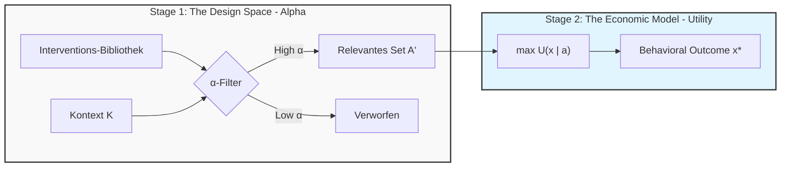

# α vs. U: Formale Unterscheidung und Visualisierung

> **Kernaussage:** α ist eine Meta-Größe über Modellen, nicht eine Variable im Modell.

---

## 1. Der Two-Stage Process (Visualisierung)



### Was dieses Bild sagt

| Stage | Funktion | Charakter |
|-------|----------|-----------|
| **Stage 1 (α)** | Technischer Filter | Machbarkeit, Passung |
| **Stage 2 (U)** | Ökonomische Optimierung | Präferenzen, Welfare |

**Zentrale Einsicht:**
- α verändert nicht U
- α definiert den Input für die Maximierung
- Stage 1 ist *vor* der ökonomischen Theorie

---

## 2. Methods Box: Formale Definition

### 2.1 The Utility Function U(x)

Let x ∈ X be a behavioral outcome and θ ∈ Θ be individual preferences.

The standard economic problem is:

```
max_x U(x; θ)  s.t.  x ∈ X
```

**Properties:**
- **Nature:** Normative, Teleological (Goal-oriented)
- **Role:** Represents the agent's welfare or preferences
- **Status:** Endogenous to the decision process

---

### 2.2 The Fit Parameter α(a, K)

Let A be the set of possible interventions and K the context features.

The fit parameter is a mapping:

```
α: A × K → [0, 1]
```

**Properties:**
- **Nature:** Descriptive, Instrumental (Means-oriented)
- **Role:** Acts as a pre-selection filter for the choice set
- **Status:** Exogenous to the agent's decision; property of environment/design

---

### 2.3 Integration

α does not enter U. Instead, it determines the effective choice architecture A' ⊂ A presented to the agent:

```
A'(K) = { a ∈ A : α(a, K) > τ }
```

The agent then maximizes U given A':

```
max_x U(x; θ)  s.t.  x ∈ X(A')
```

---

## 3. Antwort auf die "Fehr-Kritik" (Anything Goes)

### Der Vorwurf

> "Mit Behavioral Economics könnt ihr alles erklären, indem ihr einfach Parameter in die Nutzenfunktion packt (Social Preferences, Loss Aversion, etc.). Jetzt kommt ihr auch noch mit α."

### Die Antwort (Parry & Riposte)

> **"Wir tun genau das Gegenteil von 'Anything Goes'."**

1. **Wir fassen U nicht an.**
   Wir lassen die Präferenzen konstant.

2. **Wir beschränken den Raum der Modelle.**
   Normalerweise probiert ein Forscher 'ad hoc' verschiedene Nudges durch.
   Wir nutzen α, um *ex ante* zu sagen: 'In diesem Kontext sind nur
   Interventionen vom Typ X und Y zulässig, weil der Kontext Z vorliegt.'

3. **Disziplinierung statt Beliebigkeit.**
   α ist eine harte Restriktion für den Designer.
   Ein Nudge mit α ≈ 0 *darf* im Modell nicht funktionieren,
   selbst wenn wir es gerne hätten.

   **Das macht unsere Vorhersagen falsifizierbar.**

---

## 4. Implikationen für Falsifizierbarkeit

### Was α falsifizierbar macht

| Vorhersage | Test | Falsifikation |
|------------|------|---------------|
| α(Default, Finance) > 0.8 | RCT zeigt <10pp Effekt | α war falsch kalibriert |
| α(Information, Health) < 0.3 | RCT zeigt >20pp Effekt | α-Modell muss revidiert werden |
| γ(Default, Escalation) > 0 | Kombination schwächer als Summe | γ-Schätzung war falsch |

### Der entscheidende Unterschied

| Ansatz | Reaktion auf unerwartetes Ergebnis |
|--------|-----------------------------------|
| **Ad-hoc Nudging** | "Der Kontext war anders" (unfalsifizierbar) |
| **EBF mit α** | α war falsch → revidiere Kalibration (falsifizierbar) |

---

## 5. Zusammenfassung

```
┌─────────────────────────────────────────────────────────────┐
│  STAGE 1: α-Filter (vor dem Modell)                        │
│  ─────────────────────────────────────                      │
│  • Welche Interventionen passen zum Kontext?               │
│  • Technisch, deskriptiv, evidenzbasiert                   │
│  • Output: A' ⊂ A (reduziertes Set)                        │
├─────────────────────────────────────────────────────────────┤
│  STAGE 2: U-Maximierung (im Modell)                        │
│  ─────────────────────────────────────                      │
│  • Wie reagieren Akteure auf A'?                           │
│  • Normativ, präferenzbasiert                              │
│  • Output: x* (optimales Verhalten)                        │
└─────────────────────────────────────────────────────────────┘
```

### Der Satz für Reviewer

> "α is not a behavioral parameter. It is a design parameter.
> It constrains what the designer can do, not what the agent prefers.
> This makes our framework more restrictive, not less."

---

## Referenzen

- **Theorie:** `docs/methods/alpha-definition.md`
- **Pipeline:** `scripts/llmmc_to_rscore.py`
- **Kalibration:** `data/calibration/calibration_d_v1.json`, `calibration_pp_v1.json`

---

*Version 1.0 | Januar 2025 | EBF Framework*
